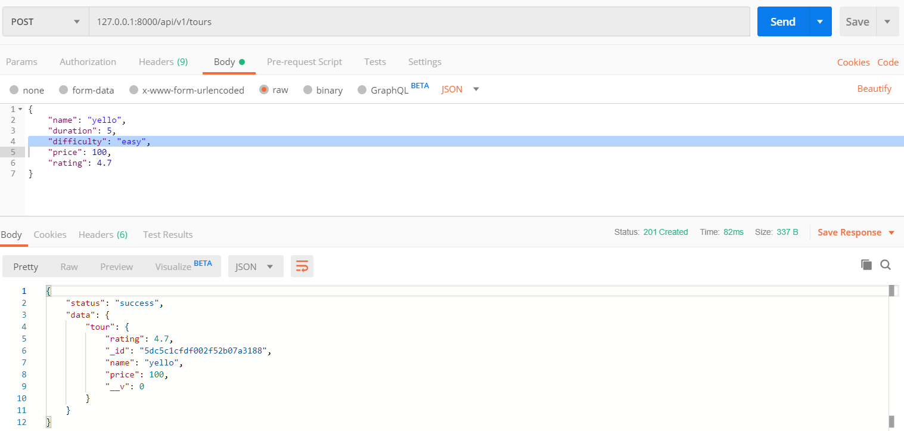

# MongoDB-with-Mongoose-Tutorial
- Connecting MongoDB database with the application and with the Mongose Library (working with MongoDB in Node.js easier)
- Mongoose is an Object Data Modeling (ODM) library for MongoDB and Node.js, a higher level of abstraction.
- Mongoose allows for rapid and simple development with MongoDB interactions
- Features: schemas to data model and relationships, easy data validation, simple query API, middleware, etc;
- ***Mongoose schema***:where we model our data, by describing the structure of the data, default values, and validation;
- ***Mongoose model***: a wrapper for the schema, providing an interface to the database for CRUD options. A model is like a *blue print* - *classes*
<br/>

## Connecting Our Database with the Express App
- get your connection string from Atlas Connect -> Connect Your Application -> Copy
- paste it the your config file config.env ```DATABASE=mongodb+srv://aygun:<password>@cluster0-hhfve.mongodb.net/test?retryWrites=true&w=majority```
- Add the password and database to the connection string  
  Change <password> to <PASSWORD>; 
  Change test to natours
- If you are using the local database create another variable in the config file ```DATABASE_LOCAL=mongodb://localhost:27017/natours```  
  In order for the local to work run your mongodb server ```mongod.exe``` in the terminal.
- next, install a mongodb driver - for node.js to interact with mongodb - ***Mongoose***  
- install Mongoose (version 5)- ```npm i mongoose@5```
- go to server.js (where we do the set up for the application); this is where we also going to configure MongoDB;
- require Mongoose package - ```const mongoose = require('mongoose');```
- use the variable and connect to mongose and pass in the connection string along with an object with some options(if you write you own app just pass in the same options)  
  before we pass in the connection string replace the password
- the connect() method is going to return a promise which gets access to a connection object (result value of the promise); use it ```then()```. Console log the object and see if we have a connection; we assume that everything works fine and didn't implement any error handling.
```JavaScript
// change the password in the connection string
const DB = process.env.DATABASE.replace(
  '<PASSWORD>',
  process.env.DATABASE_PASSWORD
);
// connect to mongoose:
mongoose
  .connect(DB, {
    useNewUrlParser: true,
    useCreateIndex: true,
    useFindAndModify: false
  })
  .then(con => {
    console.log(con.connections);
    console.log('DB connection successful');
  });
```  
Run the application and examine the connection object - ```npm run start:dev```  
```JSON
. . .
    name: 'admin',
    host: 'cluster0-shard-00-00-hhfve.mongodb.net',
    port: 27017,
    user: 'aygun',
    pass: 'NIhKQ9tWYkxxxx',
    db:
     Db {
       _events: [Object],
       _eventsCount: 3,
       _maxListeners: undefined,
       s: [Object],
       serverConfig: [Getter],
       bufferMaxEntries: [Getter],
       databaseName: [Getter] } } ]
DB connection successful
```  
- clear the promise from the connection object and just console log a message  
```JavaScript
  .then(() => console.log('DB connection successful'));
```  
- to connect to a local database - replace the hosted database version ```.connect(DB, {``` with the local database version``` .connect(process.env.DATABASE_LOCAL, {```.  
(For the next section empty the database - Go to Atlas -> Collections -> Delete (tours))  
<br/>

## Creating a Simple Tour Model
- for now code in server.js, this will later be placed in a different file:
- we create models in mongoose in order to create documents using it and also to perform CRUD operations on it.
- to create a model we need a schema(describe data, set default values, validate the data,...)
- create a schema for tours:
```JavaScript
// create schema for tours:
const tourSchema = new mongoose.Schema({
  name: {
    type: String,
    required: [true, 'A tour must have a name'], //pass in an array instead to use validators
    unique: true
  },
  rating: {
    type: Number,
    default: 4.5
  },
  price: {
    type: Number,
    required: [true, 'A tour must have a price']
  }
});
```  
- Create a model out of that schema:
```JavaScript
// create a model out of that schema
const Tour = mongoose.model('Tour', tourSchema);
```  
<br/> 

## Creating Documents (in code) and Testing the Model
- create a variable, this will  be a new document created out of the Tour model 
```JavaScript
// create a document of Tour (instance of Tour)
const testTour = new Tour({
  name: 'The Forest Hicker',
  rating: 4.7,
  price: 497
});
```  
- This instance of the Tour model which has now a couple of methods that we can use in order to interact with the database.  
```JavaScript
// interact with the database (the save method returns a promise that we can then consume - later we will be using async/await in order to consume these promises)
testTour
  .save()
  .then(doc => {
    console.log(doc);
  })
  .catch(err => {
    console.log('Error!', err);
  });
```  
Run the application; the console will display the document that was just saved in the database:  
```JSON
DB connection successful
{ rating: 4.7,
  _id: 5db9e143e89cd960b0ca5ba1,
  name: 'The Forest Hicker',
  price: 497,
  __v: 0 }
``` 
- move over to Atlas and look at our database - you will see that the Collection and document are created and saved. (DISPLAY IT IN COMPASS!!)
  
<br/>

---
# Build the API with a Database

## Intro to Back-End Architecture: MVC, Types of Logic, and More
  
  
### Refactoring to MVC
- We already have the controller and routes folder. Create a models folder and add a tourModel.js file to it.
- copy and past tourSchema, mongoose from the server.js to this file. Export the Tour at the end.  
 

**Model - tourModel.js**:  

```JavaScript
// require mongoose package
const mongoose = require('mongoose');

// create schema for tours:
const tourSchema = new mongoose.Schema({
  name: {
    type: String,
    required: [true, 'A tour must have a name'], //pass in an array instead to use validators
    unique: true
  },
  rating: {
    type: Number,
    default: 4.5
  },
  price: {
    type: Number,
    required: [true, 'A tour must have a price']
  }
});

// create a model out of that schema
const Tour = mongoose.model('Tour', tourSchema);

//export the Tour
module.exports = Tour;
```  
## Create Documents
- Import the tour model to the tourController.js - (API).
- We will be using **Mongoose's Query Methods** - ```findById```, ```findByIdAndUpdate```,... *(look up mongoose documnetation)*.
- recap that, as soon as we get a post request in the tourRoutes.js the createTour functions in the tourController.js will be hit:  

***tourRoutes.js file:***  

```JavaScript
router
  .route('/')
  .get(tourController.getAllTours)
  .post(tourController.createTour);
```   
***tourController.js*** - this will create a tour from the data that comes from the body:   
```JavaScript
// Create a Tour from the data that comes from the body:
/*
- One way to create a tour:
	const newTour = new Tour({});
	newTour.save();

- Another way to create a tour:
call the create method on the model itself; notice that instead of using promises with .then() function,
we are are using asynch/await and save the result value of the promise in a variable; 
also pass in some real data into the create method. 
Note that with async/await you have to use try/catch to test for errors */
	exports.createTour = async (request, response) => {
	  try {
		const newTour = await Tour.create(request.body);
		response.status(201).json({
		  status: 'success',
		  data: {
			tour: newTour
		  }
		});
	  } catch (err) {
		// the promise that was created (Tour.create()) and rejected will enter here!
		response.status(400).json({
		  status: 'fail',
		  message: err
		});
	  }
	};
```  
Test you application with postman -  
- You don't see diffuculty and duration created, because they are not in your schema and therefore not put into the database.  
  
- Open Mongoose and check out the entry  
  

## Reading Documents  
- implement and getTours and getAllTours route handler  
tourController.js - getAllTours.js:  
```JavaScript
// get ALL Tours
exports.getAllTours = async (request, response) => {
  try {
    // use the models find method - gets all data in Tour collection
    const tours = await Tour.find();

    response.status(200).json({
      status: 'success',
      results: tours.length,
      data: {
        tours
      }
    });
  } catch (err) {
    response.status(404).json({
      status: 'Fail',
      message: err
    });
  }
};
```  
Test getAllTours handler in postman:   
  

Next, implement the getTour handler:  
```JavaScript
// get a Tour
exports.getTour = async (request, response) => {
  try {
    // examine router and see how we specify the id in the URL
    const tour = await Tour.findById(request.params.id);
    // same as above (with filter object):
    // Tour.findOne({ _id: request.params.id });

    response.status(200).json({
      status: 'success',
      data: {
        tour
      }
    });
  } catch (err) {
    response.status(404).json({
      status: 'Fail',
      message: err
    });
  }
};
```  
Test getTour handler in postman:   
  
<br/>  

## Updating Documents:  
```JavaScript
// update a Tour
exports.updateTour = async (request, response) => {
  try {
    // get document to update - await the result of the query
    const tour = await Tour.findByIdAndUpdate(request.params.id, request.body, {
      // query method optional params(mongoose docs)
      new: true,  // returns new tour
      runValidators: true // retuns error if input type wrong.
    });

    response.status(200).json({
      status: 'success',
      data: {
        tour: tour  // in ES6 all we write is -> tour
      }
    });
  } catch (err) {
    response.status(404).json({
      status: 'Fail',
      message: err
    });
  }
};
```  
  
<br/>

## Deleting Documents:  
```JavaScript
// delete a Tour
exports.deleteTour = async (request, response) => {
  try {
    await Tour.findByIdAndDelete(request.params.id);

    response.status(204).json({
      status: 'success',
      data: null
    });
  } catch (err) {
    response.status(404).json({
      status: 'Fail',
      message: err
    });
  }
};
```  
<br/>

## Modelling the Tours
- We will update the tourSchema since we have a lot more data about a tour in reality - ```https://www.natours.dev/api/v1/tours/```
- Here is the updated Schema (tourModel.js) that accepts more properties as an input 
```JavaScript
const tourSchema = new mongoose.Schema({
  name: {
    type: String,
    required: [true, 'A tour must have a name'], //pass in an array instead to use validators
    unique: true,
    trim: true
  },
  duration: {
    type: Number,
    required: [true, 'A tour must have a duration']
  },
  maxGroupSize: {
    type: Number,
    required: [true, 'A tour must have a size']
  },
  difficulty: {
    type: String,
    required: [true, 'A tour must have a difficulty']
  },
  ratingsAverage: {
    type: Number,
    default: 4.5
  },
  ratingsQunatity: {
    type: Number,
    default: 0
  },
  price: {
    type: Number,
    required: [true, 'A tour must have a price']
  },
  priceDiscount: Number,
  summary: {
    type: String,
    trim: true,
    required: [true, 'A tour must have a description']
  },
  description: {
    type: String,
    trim: true
  },
  imageCover: {
    type: String,
    required: [true, 'A tour must have a cover image']
  },
  images: [String], //array of strings (references)
  createdAt: {
    type: Date,
    default: Date.now()
  },
  startDates: [Date]
});
```  
Now, when we can create a new tour in Postman that accepts more data; and save it on the database. Here is an example tour :  
```JSON
            {
                "ratingsAverage": 4.7,
                "ratingsQunatity": 0,
                "images": [
                    "tour-1-1.jpg",
                    "tour-1-2.jpg",
                    "tour-1-3.jpg"
                ],
                "createdAt": "2019-11-11T19:43:51.670Z",
                "startDates": [
                    "2021-04-25T14:00:00.000Z",
                    "2021-07-20T14:00:00.000Z",
                    "2021-10-05T14:00:00.000Z"
                ],
                "_id": "5dc9ba86084d306b9c12233c",
                "name": "The Forest Hiker",
                "duration": 5,
                "maxGroupSize": 25,
                "difficulty": "easy",
                "price": 397,
                "summary": "Breathtaking hike through the Canadian Banff National Park",
                "description": "Ut enim ad minim veniam, quis nostrud exercitation ullamco laboris nisi ut aliquip ex ea commodo consequat. Duis aute irure dolor in reprehenderit in voluptate velit esse cillum dolore eu fugiat nulla pariatur.\nLorem ipsum dolor sit amet, consectetur adipisicing elit, sed do eiusmod tempor incididunt ut labore et dolore magna aliqua. Excepteur sint occaecat cupidatat non proident, sunt in culpa qui officia deserunt mollit anim id est laborum.",
                "imageCover": "tour-1-cover.jpg",
                "__v": 0
            }
```  
<br/>
  
---
### Importing Development Data (Reading from JSON file and saving to MongoDB)
**Note**: this exercize is independed of the rest of the express application.
- we are adding this script file to dev-data -> data -> import-dev-data.js
```JavaScript
// require the fileSystem module (to access the JSON file)
const fs = require('fs');

// require mongoose package
const mongoose = require('mongoose');

// require the environmetal variable module
const dotenv = require('dotenv');

// require the tourModel (we will write to tours)
const Tour = require('../../models/tourModel');

// read and save the environmental variables in node.js
dotenv.config({ path: './config.env' });

// access the database only once; change password in connection string
const DB = process.env.DATABASE.replace(
  '<PASSWORD>',
  process.env.DATABASE_PASSWORD
);

// connect to mongoose:
mongoose
  .connect(DB, {
    useNewUrlParser: true,
    useCreateIndex: true,
    useFindAndModify: false
  })
  .then(() => console.log('DB connection successful'));

//READ JSON file
const tours = JSON.parse(
  fs.readFileSync(`${__dirname}/tours-simple.json`, 'utf-8')
);

// IMPORT DATA INTO DB
const importData = async () => {
  try {
    await Tour.create(tours);
    console.log('Data successfully loaded');
  } catch (err) {
    console.log(err);
  }
  process.exit(); // stopping app in terminal
};

// DELETE  ALL DATA FROM DB
const deleteData = async () => {
  try {
    await Tour.deleteMany();
    console.log('Data successfully deleted');
  } catch (err) {
    console.log(err);
  }
  process.exit(); // stopping app in terminal
};

/* Executing Code in the Comment Line
   - instead of a functions call (importData(), deleteData()) we will interact with the comment line
   - note that we can access the arguments in comment line with process.argv:
*/   
console.log(process.argv);
```  
Run the application in another terminal and add another argument at the end - ```> node dev-data/data/import-dev-data.js --import```  
The output on the console will be these 3 lines of ```process.argv``` arguments:  

```JavaScript
/*
[ 'C:\\Program Files\\nodejs\\node.exe',  
 
 'C:\\Users\\aygun\\OneDrive\\Documents\\GitHub\\Express_Tutorial\\dev-data\\
 data\\import-dev-data.js',  
 
  '--import' ]
*/
```  
Add the following if statement (before calling ```process.argv()```); and check the third argument which will be added in the terminal; and make the right function call.   
```JavaScript
if (process.argv[2] === '--import') {
  importData();
} else if (process.argv[2] === '--delete') {
  deleteData();
}

console.log(process.argv);
```  
Delete all the data from the database in the terminal - ```> node dev-data/data/import-dev-data.js 
--delete```  
OUTPUT:  
```
DB connection successful
Data successfully deleted
```  
You can add ```process.exit()``` right after try-catch in the deleteData() and importData() function to stop the application in the terminal.  
<br/>

Import all the data from the JSON file into the database - ```> node dev-data/data/import-dev-data.js 
--delete```  
OUTPUT: The data is read from the JSON file and added to the database.  
```
DB connection successful
Data successfully loaded
```  
---  
## Making the API Better: Filtering  
- Allow the user to filter data using a Query String(key-value pairs in the URL)  
  Example: ```127.0.0.1:8000/api/v1/tours?duration=5&difficulty=easy```  
- In Postman we can add the query string in the Query Params Section; and turn the query strings on/off with a checkmark next to each key-value.   
    
-  Next ***access the data from the query string in the express application*** with the```query``` function.  
  Express does this for us in order to make node.js development a lot faster.  

Here we see an example of how to access the data:  
  
```JavaScript  
// get Tours (Filter)
exports.getAllTours = async (request, response) => {
  try {
		// access data in the query string:
		console.log(request.query);

		const tours = await Tour.find();

		response.status(200).json({
		  status: 'success',
		  . . .
};
```  
Make the API request in Postman -  
  
OUTPUT:  
```JavaScript
App running on port 8000...
DB connection successful
Hello from the middleware
{ duration: '5', difficulty: 'easy' }
GET /api/v1/tours?duration=5&difficulty=easy 200 49.183 ms - 9378
```  
<br/>

- Next use the data in order to implement it for filtering  
- In Mongoose there are two ways of writing queries.  
  - The first way is to pass in a filter object to the find method.   
```JavaScript
  // get Tours (Filter)
exports.getAllTours = async (request, response) => {
  try {
    console.log(request.query);
    // use the models (mongoose) find method with the filter object
    const tours = await Tour.find({
      duration: 5,
      difficulty: 'easy'
    });

    response.status(200).json({
      status: 'success',
	  . . . 
};
/*
	***Simple Query Implementation***
	Just pass in the data from the query string to the query() function. 
*/
	const tours = await Tour.find(request.query);
```  
	
  - The second way is to chain some special Mongoose method for querying  
  ```JavaScript
      // get ALL Tours
exports.getAllTours = async (request, response) => {
  try {
    // another way to filter:
    const tours = await Tour.find()
      .where('duration')
      .equals(5)
      .where('difficulty')
      .equals('easy');

    response.status(200).json({
      status: 'success',
	  . . .
};  
  ```  
<br/>

- Change this simple query implementation to be able to have paging and sorting functionality in the query paramters. We need to make sure we are not querying for these in the database. ***Exclude these special field names from the query string before filtering***.  
  If we add page=2 in the query string for example, we would not get any result because we don't have a document with page set to 2.  
- Get a hard copy of the query string by using ***destructuring***. - *The destructuring assignment syntax is a JavaScript expression that makes it possible to unpack values from arrays, or properties from objects, into distinct variables.*- Create an array of all the things we want to exclude 
- Remove all elements in the array from the query object by using the delete operator
- Save the query for sorting, project, or other possible implementations and await it at the end.  
Final query code:  
```JavaScript
// get ALL Tours
exports.getAllTours = async (request, response) => {
  try {
    // BUILD QUERY
    const queryObj = { ...request.query };
    const excludeFields = ['page', 'sort', 'limit', 'fields'];
    excludeFields.forEach(el => delete queryObj[el]);

    const query = Tour.find(queryObj);

    // EXECUTE QUERY
    const tours = await query;

    //SEND RESPONSE
    response.status(200).json({
      status: 'success',
      results: tours.length,
      data: {
        tours
      }
    });
  } catch (err) {
    response.status(404).json({
      status: 'Fail',
      message: err
    });
  }
};
```  
Now when you request ```127.0.0.1:8000/api/v1/tours?difficulty=easy&page=2&sort=1&limit=10```in the URL page,sort and limit will be removed before database is filtered.

<br/>

## Making the API Better: Advanced Filtering
- Implementing different operators in the query 
- In mongodb, this is how we would manually write the filter object for the query:  ```{ difficulty: 'easy', duration: { $gte: 5 } }```
- Standart way of writing the query string including these operators: ```127.0.0.1:8000/api/v1/tours?duration[gte]=5&difficulty=easy```
- the output for this request in the console is```{ difficulty: 'easy', duration: { gte: '5' } }```; so very similar to the filter object syntax. We just need to add the $ infront of the operators for filtering.  
Final Code for Filtering:  
```JavaScript
exports.getAllTours = async (request, response) => {
  try {
    // Simple Filtering
    //const tours = await Tour.find(request.query);

    // BUILD QUERY
    const queryObj = { ...request.query };
    const excludeFields = ['page', 'sort', 'limit', 'fields'];
    excludeFields.forEach(el => delete queryObj[el]);

    // Advanced Filtering with Different Operators - gte, gt, lte, lt
    let queryStr = JSON.stringify(queryObj);
    queryStr = queryStr.replace(/\b(gte|gt|lte|lt)\b/g, match => `$${match}`);

    const query = Tour.find(JSON.parse(queryStr));

    // EXECUTE QUERY
    const tours = await query;

    // SEND RESPONSE
    response.status(200).json({
      status: 'success',
      results: tours.length,
      data: {
        tours
      }
    });
  } catch (err) {
    response.status(404).json({
      status: 'Fail',
      message: err
    });
  }
};
```  
<br/>

## Making the API Better: Sorting
- In this example the user will be able to sort a field by passing it into the querystring -```127.0.0.1:8000/api/v1/tours?sort=price```. For descending order sorting place a minus(-) sign infront of price.  
```JavaScript
    let query = Tour.find(JSON.parse(queryStr));

    // SORTING
    if (request.query.sort) {
      // query = query.sort(request.query.sort); -> one sorting criteria
      const sortBy = request.query.sort.split().join(' ');  // -> multiple sorting criteria
      query = query.sort(sortBy);
    } else {
      query = query.sort('-createdAt');  // -> default sorting
    }

    // EXECUTE QUERY
    const tours = await query;
```  
Postman request with a sorting querystring - ```127.0.0.1:8000/api/v1/tours?sort=price,ratingAverage``` will result an Output of a tours list that is sorted by price and ratingAverage.
 
## Making the API Better: Limiting Fields
- Allow clients which field they want to get back in the response. This is also called **Projecting** - ```127.0.0.1:8000/api/v1/tours?fields=name,duration,difficulty,price```
- The implementations will be similar to sorting  
```JavaScript
    // FIELD LIMITING
    if (request.query.fields) {
      const fields = request.query.fields.split(',').join(' ');
      query = query.select(fields);
    } else {
      query = query.select('-__v');  // -> default will exclude the field mongoose creates and resond the rest
    }

    // EXECUTE QUERY
    const tours = await query;
```
- We can also exclude field in the Schema, this is useful when we have sensitive data and make sure it won't be passed to the user. Go to the tourModel and set the select property for false. For example, the following will permanently hide the created date from the output:
```JSON
  createdAt: {
    type: Date,
    default: Date.now(),
    select: false
  },
```
<br/>

## Making the API Better: Pagination
- Paging with the querystring - ```127.0.0.1:8000/api/v1/tours?page=2&limit=10```
- This is how we implement paging in  mongoose:
```JavaScript
    // PAGINATION

    // ?page=2&limit=10 -> 1-10, page 1; 11-20 page 2; ...
    // query = query.skip(10).limit(10);

    // get the page and limit first
    // default is page 1 and limit 100
    const page = request.query.page * 1 || 1;
    const limit = request.query.limit * 1 || 100;
    const skip = (page - 1) * limit;

    query = query.skip(skip).limit(limit);

    if (request.query.page) {
      const numTours = await Tour.countDocuments();
      if (skip >= numTours) throw new Error('This page does not exist'); // send to the catch block
    }

    // EXECUTE QUERY
    const tours = await query;
	
	...
```  
<br/>

##  Making the API Better: Aliasing
- Provide an Alias Route, to make requests that are popular; for example, making a request for the the 5 best, cheapest tours (notice the - before the fields) - ```127.0.0.1:8000/api/v1/tours?limit=5&sort=-ratingAverage,price```  
- First, create a new route in the tourRouter.js  
  We need a middleware before we run the getAllTours handler. This middleware functions is going to manipulate the query object that is comming in.  
  We name the middlew function ```aliasTopTours```. Next create this middleware function in tourController.js  
<br/>

tourRoutes.js:  
```JavaScript
// create a new route for Aliasing
router
  .route('/top-5-cheap')
  .get(tourController.aliasTopTours, tourController.getAllTours);
```  
tourController.js: (add the middleware somewhere on the top)  
```JavaScript
// Aliasing the API
exports.aliasTopTours = (req, res, next) => {
  req.query.limit = '5';
  req.query.sort = '-ratingAverage,price';
  req.query.fields = 'name,price,ratingsAverage,summary,difficulty';
  next();
};
```  
Now make a request with this new route in Postman - ```127.0.0.1:8000/api/v1/tours/top-5-cheap```  

<br/>

## Refactoring API Features
- Add a Class with methods for each of the API features - and create a new model - apiFeatures.js
- Cut the code out of the getAllTours function and create the methods inside a classin this new module.  
```JavaScript
class APIFeatures {
  // passing in Mongoose query and the queryString that we get from Express (the route)
  constructor(query, queryString) {
    this.query = query;
    this.queryString = queryString;
  }

  filter() {
    const queryObj = { ...this.queryString };
    const excludeFields = ['page', 'sort', 'limit', 'fields'];
    excludeFields.forEach(el => delete queryObj[el]);

    // Advanced Filtering with Different Operators - gte, gt, lte, lt
    let queryStr = JSON.stringify(queryObj);
    queryStr = queryStr.replace(/\b(gte|gt|lte|lt)\b/g, match => `$${match}`);

    this.query = this.query.find(JSON.parse(queryStr));

    // returns the object so we can chain sort() method onto it
    return this;
  }

  sort() {
    if (this.queryString.sort) {
      const sortBy = this.queryString.sort.split().join(' ');
      this.query = this.query.sort(sortBy);
    } else {
      this.query = this.query.sort('-createdAt'); // -> default sorting
    }
    return this;
  }

  limitField() {
    if (this.queryString.fields) {
      const fields = this.queryString.fields.split(',').join(' ');
      this.query = this.query.select(fields);
    } else {
      this.query = this.query.select('-__v'); // -> default will exclude the field mongoose creates and resond the rest
    }
    return this;
  }

  paginate() {
    const page = this.queryString.page * 1 || 1;
    const limit = this.queryString.limit * 1 || 100;
    const skip = (page - 1) * limit;

    this.query = this.query.skip(skip).limit(limit);

    return this;
  }
}

module.exports = APIFeatures;
```  
- require this module in tourController.js  
```JavaScript
// require the apiFeatures
const APIFeatures = require('./../utils/apiFeatures');
```  
- declaring an instance of APIFeatures to access these methods in the getAllTours route handler.  
```JavaScript
// ROUTE HANDLER for Tours

// get ALL Tours
exports.getAllTours = async (request, response) => {
  try {
    // EXECUTE QUERY
    const features = new APIFeatures(Tour.find(), request.query)
      .filter()
      .sort()
      .limitField()
      .paginate();
	  
    const tours = await features.query;

    // SEND RESPONSE
    response.status(200).json({
      status: 'success',
      results: tours.length,
      data: {
        tours
      }
    });
  } catch (err) {
    response.status(404).json({
      status: 'Fail',
      message: err
    });
  }
};
```  
<br/>

## Aggregation Pipeline: Matching and Grouping
- Declare a pipline through which documents will be manipulated to become aggregated results.  Here we will use Mongodb features - lookup MongoDB Documentation for Aggreagtion and Aggreagtion Pipeline - Reference - ***Operators***; we will be passing in some of these operators to the ```aggregate``` function as arguments.
- it is a bit like working with query, the difference is that with ```aggregate()``` we can manipulate the data in a few different steps.  
  
- Note that:  
  ```match``` is used to select or filter the documents; just like a filter object in MongoDB;  
  each of the states is an object;  
tourController.js file:  
```JavaScript
// HANDLER FOR AGGREGATE FUNCTIONS
exports.getTourStats = async (request, response) => {
  try {
    // if you don't await here, it returns an aggregate object instead
    const stats = await Tour.aggregate([
      {
        $match: { ratingsAverage: { $gte: 4.5 } }
      },
      {
        $group: {
          _id: { $toUpper: '$difficulty' },
          // _id: '$difficulty', // groups tours;
          //_id: null, // null is default
          numTours: { $sum: 1 }, // adds one for each tour
          numRatings: { $sum: '$ratingsQuantity' },
          avgRating: { $avg: '$ratingsAverage' },
          avgPrice: { $avg: '$price' },
          minPrice: { $min: '$price' },
          maxPrice: { $max: '$price' }
        }
      },
      {
        $sort: { avgPrice: 1 } // 1 for ascending
      }
      // {
      //   $match: { _id: { $ne: 'EASY' } } // leaves out
      // }
    ]);

    response.status(200).json({
      status: 'success',
      data: {
        stats
      }
    });
  } catch (err) {
    response.status(404).json({
      status: 'Fail',
      message: err
    });
  }
};
```  
Add a new Route to tourRouters.js:  
```JavaScript
// create a new route for matching and grouping
	router.route('/tour-stats').get(tourController.getTourStats);
```  
Run the app; make a ```127.0.0.1:8000/api/v1/tours/tour-stats``` request in Postman  
  
<br/>

## Aggregation Pipeline: Unwinding and Projecting
- Create another function using the aggregation pipeline to calculate the busiest month of a given year.  
```JavaScript
exports.getMonthlyPlan = async (request, response) => {
  try {
    // define the year - passed in with URL param
    const year = request.params.year * 1;
    // find the starting date for each tours; unwind and match
    const plan = await Tour.aggregate([
      {
        $unwind: '$startDates' // one tour for each date
      },
      {
        $match: {
          startDates: {
            $gte: new Date(`${year}-01-01`),
            $lte: new Date(`${year}-12-31`)
          }
        }
      },
      {
        $group: {
          _id: { $month: '$startDates' }, // use mongoDB aggregation pipeline operators (what from where?)
          numToursStarts: { $sum: 1 }, // count tours
          tours: { $push: '$name' } // which tours - array
        }
      },
      {
        $addFields: { month: '$_id' }
      },
      {
        $project: {
          _id: 0 // 0 will not show
        }
      },
      {
        $sort: { numToursStarts: -1 } // -1 for descending
      }
    ]);

    response.status(200).json({
      status: 'success',
      data: {
        plan
      }
    });
  } catch (err) {
    response.status(404).json({
      status: 'Fail',
      message: err
    });
  }
};
```
- implement the route in tourRoutes.js:
```JavaScript
// create a new route (AGGREGATE Pipeline)
router.route('/monthly-plan/:year').get(tourController.gtMonthlyPlan);  
```  
Run the app; make a ```127.0.0.1:8000/api/v1/tours/monthly-plan/2021``` request in Postman  
  
<br/>  

##  Virtual Properties
- Working on the model - tourModel.js
- ***Virtual Properties*** - are fields that we can define on our schema that will not be persistant/saved into the database.
- Create a virtual porperty that contains the tour duration in weeks.  
```JavaScript
// Define a Virtual Property:
// use a regular function instead of an arrow function because we need this keyword
tourSchema.virtual('durationWeeks').get(function() {  
  return this.duration / 7;
});
```  
- define in the schema that we want the virtual properties in the output:
```JavaScript
// create schema for tours:
const tourSchema = new mongoose.Schema(
  {
    name: {
    . . .
	
  },
  {
    toJSON: { virtuals: true },
    toObject: { virtuals: true }
  }
);
```  
<br/>

## Document Middleware
- Like Express, Mongoose also has the concept of middleware
- Each time a new document is saved in the database, we can run functions that run before or after the event.
- The are four types of middleware in Mongoose:
  1. DOCUMENT
  2. QUERY
  3. AGGREGATE
  4. MODEL 

- ***Document Middleware***
  - middleware that works on the currently processed document.
  - we define a middleware on the schema just like virtual properties.  
- Create a Pre Document Middleware Example:  
In this example we will create a slug for each of the document. (A ***Slug*** is a string that we can put in the URL - for that we used the Slugify package).  
First install slugify - ```npm i slugify```  
Require it in tourModel.js - ```const slugify = require('slugify');```  
Create the Pre Document Middleware -  
```JavaScript
// DOCUMENT MIDDLEWARE: runs before .save() and .create()
tourSchema.pre('save', function(next) {
  this.slug = slugify(this.name, { lower: true });
  next();
});
```  
Add the variable to the schema.  
```JavaScript
// create schema for tours:
const tourSchema = new mongoose.Schema(
  {
    name: {
    . . .
	},
    slug: String,  // adding variable to schema
	. . .
  },
  . . .
);
```  

Run the app; make a post```127.0.0.1:8000/api/v1/tours``` request in Postman - this will create a slug property which is based on the name, before the output. 
  

- Create a Post Document Middleware Example:  
```JavaScript
// DOCUMENT MIDDLEWARE: post middleware not only has access to next() function,
// but also to  the document that was just saved to the database.
tourSchema.post('save', function(doc, next) {
  // here we have the finished document
  console.log(doc);
  next();
});
```  
<br/>

## Query Middleware  
- allows us to run functions before or after a certain query is executed.
- in this example we are adding a ***Pre Find Hook***:  
In tourModel.js -  
```JavaScript

```  
Add the variable to the schema.
```JavaScript
// create schema for tours:
const tourSchema = new mongoose.Schema(
  {
	. . .
  },
    startDates: [Date],
	
    secretTour: {
      type: Boolean, // true if secret tour
      default: false
    }
  },
  . . .
);
```  
Create a secret tour for testing purpose:  
 

  


